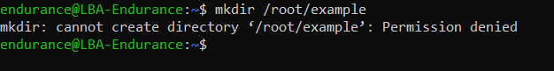

# LINUX-INTRODUCTION

## What is a Linux Command?
##### A Linux command refers to a program or utility that runs in the Command-Line Interface (CLI), which is a text-based environment where you interact with the system by typing commands.

##### Linux commands are executed by typing text in the terminal and pressing Enter. These commands allow you to perform various tasks, such as installing software packages, managing users, manipulating files and directories, configuring system settings, and more.

#####  Syntax of a Linux Command
#####  A Linux command usually follows this general syntax:

##### CommandName: The main action or task you want to perform. For example, to list files in a directory, you use the ls command.

##### Option or Flag: Modifies how a command works, often preceded by a hyphen (-) or double hyphen (--). For example, ls -l lists files with detailed information.

##### Parameter or Argument: Provides specific data for the command to act upon. For example, to create a directory named "photos," you use: mkdir photos.

##### Note: Linux commands are case-sensitive, so you must type them exactly as shown.
##### Manipulating Files and Directories in Linux
##### Most tasks in Linux involve working with files and directories. Important commands to know include:

- ls – lists files and directories.
    

- cd – changes the current directory.
  

  

### - mkdir – creates a new directory.

#### - rm – deletes files or directories.

#### - mv – moves or renames files and directories.

#### - touch – creates an empty file.
  

# - find – searches for files and directories.
   

### The sudo Command
##### Some tasks in Linux require superuser (root) privileges, like modifying system files or creating directories in protected areas. The sudo command allows you to execute commands with elevated permissions.

#### Why use sudo?

##### Security: Limits access to powerful commands to authorized users.
##### Tracking: Logs who ran what command, increasing accountability.
## How sudo works:
##### When you prefix a command with sudo, Linux asks for your password. After entering it, you can run commands as the superuser for a short period (usually 15 minutes) without needing to enter your password again.

##### Example: Creating a directory in the /root folder (which is restricted):

## sudo mkdir /root/example
##### This command creates a directory named "example" in /root using superuser privileges.

##### Checking Your Current Directory: The pwd Command
##### To find out your current working directory, use the pwd command. It prints the full path of the directory you're in.

##### /home/username
##### Understanding the Linux Directory Structure
##### The Linux filesystem starts from the root directory /. All files and directories branch from here. Some important directories include:

- /bin – essential command binaries (like ls, cp).

- /etc – configuration files.

- /home – users’ personal directories.

- /root – home directory for the root user.

 - /var – variable files like logs.

- /usr – contains user utilities and applications.

### Navigating and Managing Files in Linux
#### /usr – contains user utilities and applications.
### Use the following commands for file and directory management:

## ls – list directory contents.

## ls – list directory contents.

## ls – list directory contents.

cd – change directory.

## mkdir – make new directories.

## The cp command is used to copy files and directories from one location to another in the Linux filesystem.

### cp [options] source destination
- cp file1.txt /home/username/Documents/
  - cp file1.txt file2.txt
     - cp -r myfolder /home/username/backup/
  
